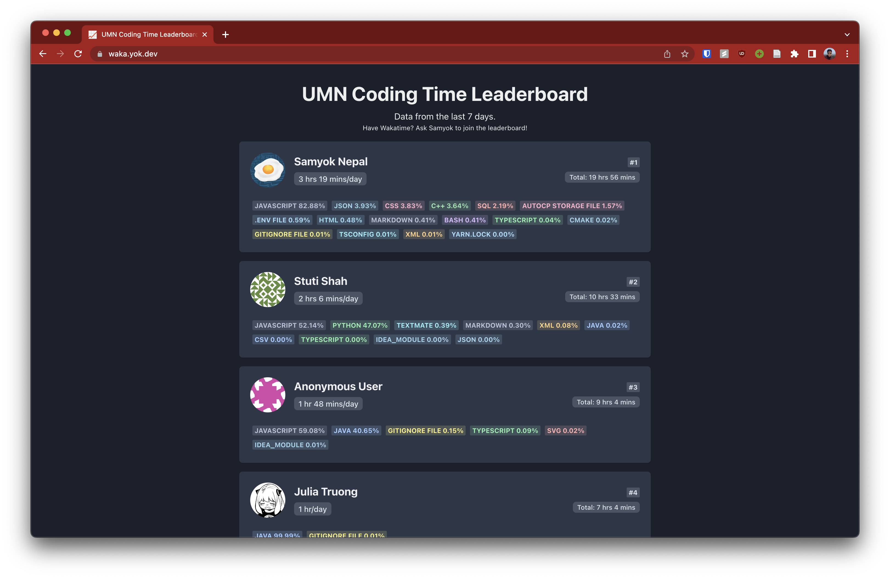

[](https://waka.yok.dev)

# Waka Leaderboard!
This is a really basic NextJS app to coalesce the WakaTime API into a leaderboard. 

You can run it locally by copying the `.env.example` file to `.env` and filling in the `WAKATIME_API` variable with your WakaTime API Key.

Then, you can run
```bash

yarn install
yarn dev

```

and it'll be live at http://localhost:3000.
